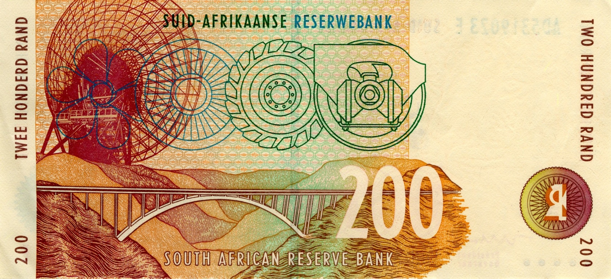
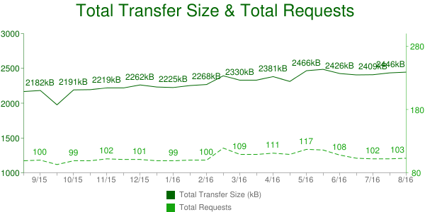
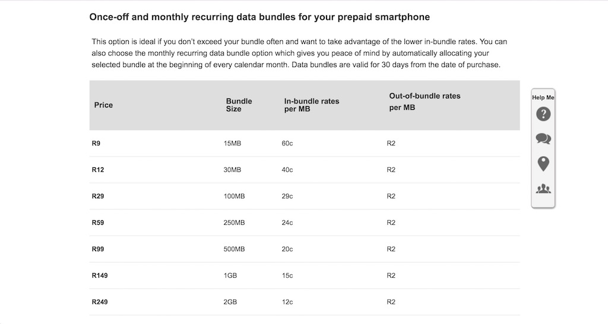
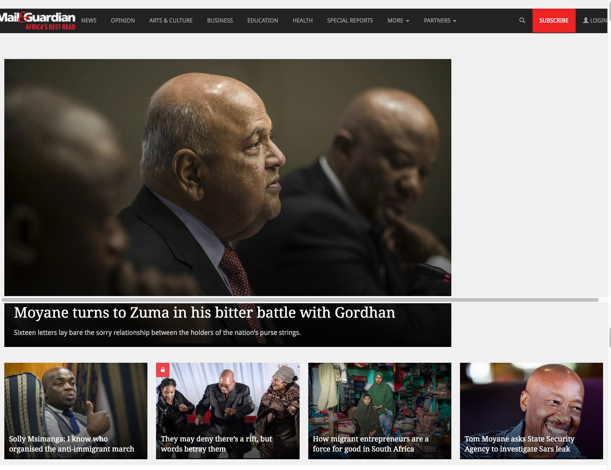
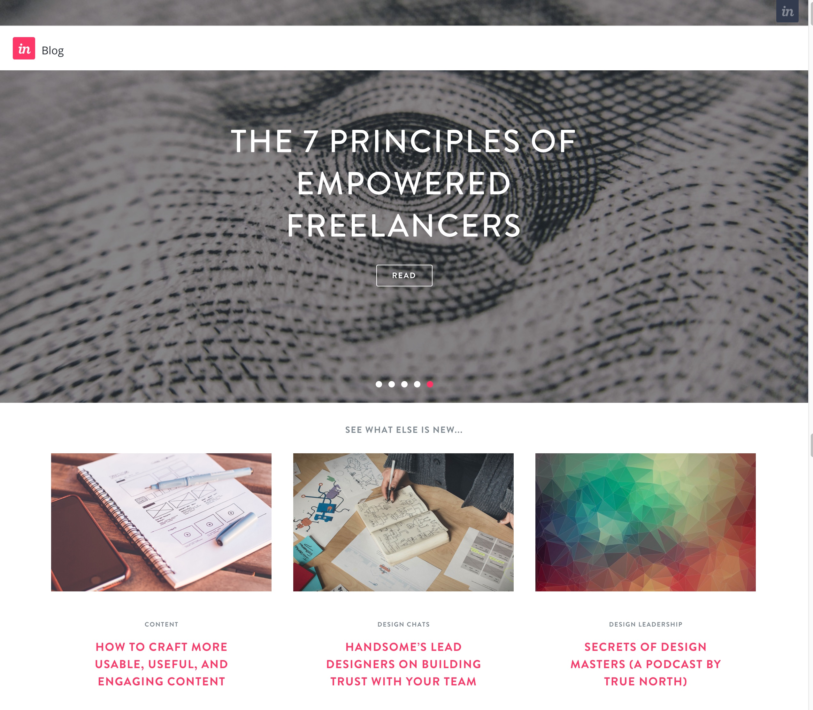
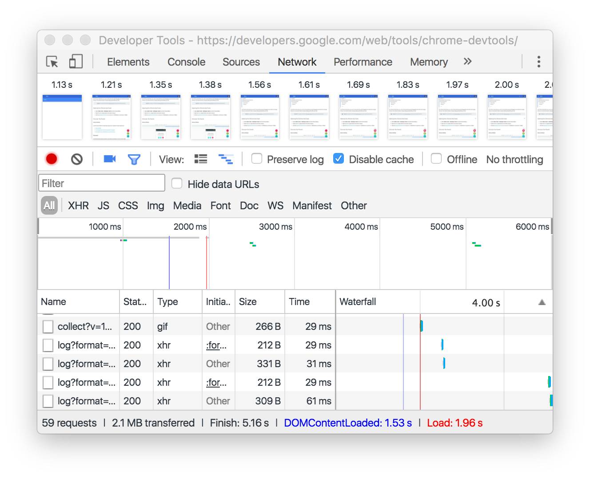
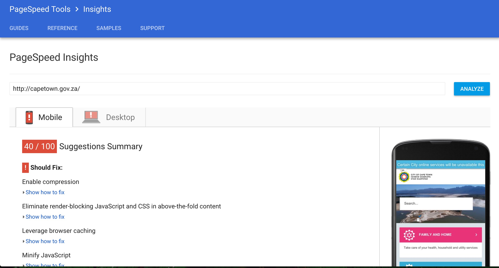
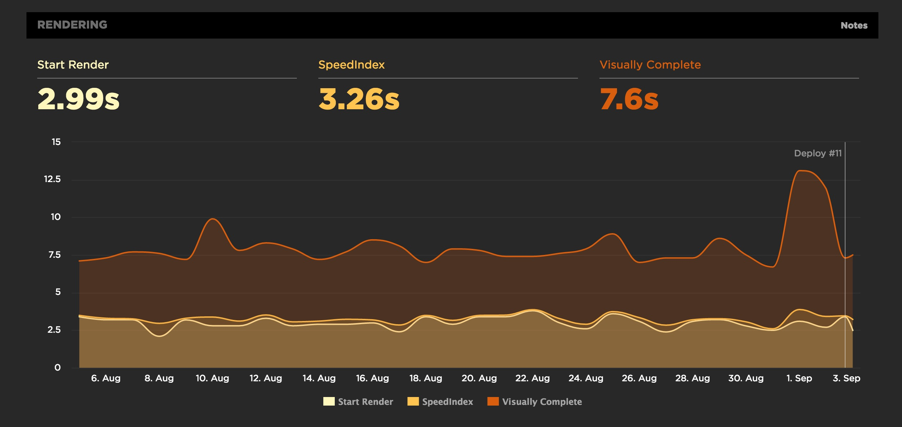

theme: Fira, 1

# Performance
## **#perfmatters**

^ (Front-end) That's us.
How does that effect the design

---

## Save users **Time**
## Save users **Money**
## Save us **Money**

---

# Big Faces

 

^ Intro the other
Where work, What do

---

### **Agenda**

## 1. What?
## 2. So what?
## 3. Now what?

^ 1. What (is perf)?
2. So what?
So what (Part 2)?
4. Now what (can we do)?

---

# **1. What?**

---

# (Front-end) Performance

^ What's Front-end?
(e.g. vs back-end)
Simplified version of perf

---

# 1. Speed

^ Speed has perceived vs actual

---

# 2. Weight

^ Weight: how many MBs
Smaller better
Initial page load vs later

---

# **2. So what?**

^ Why should you care about your site's speed and weight?
A bit slow, a bit chunky, so what?
Gonna hit you in the feels

---

^ Bongani, Persona
Who knows / uses Personas?

---

## **Bongani**
## Cashier at Pluck n Pay
## **R5,000 / month**

^ But data's cheap, right?
Persona: edge cases / worst case scenario!

---

## "I want to look for a new job."

^ What's that going to cost her?

---

## httparchive.org
## **Average page size: 2.5MB**

^ Doesn't seem so bad...
How much does that cost?

---

## Vodacom pre-paid
## **About R1.5 per page**

^ R9 for 15MB
R0.60 per MB
People limit usage by buying small amounts
Because it's expensive
Convert airtime to data: that means out of bundle rates

---

## Bongani looks for a job
## **10 pages a day**
## 9% of daily income

---

## Whisky
## Tango
## Foxtrot?

---

# :poop::poop::poop:

^ That is a very shit thing
Wish the poop wasn't smiling

---

# **2. So what?** (Part 2)

^ wpostats.com (mostly)
"Personas are made up? What about the real world?"
"Also, I sell organic artisinal diamonds, my customers are rich!"

---

## Site
## **Stat**
## Effect

---

# **Yikes!**
# :scream:

---

## Bing

## **2s delay**
## 4.3% drop in revenue

---

## Google

## **0.5s slower load time**
## 25% fewer searches

---

## Financial Times

## **3s slower load time**
## 7.2% drop in articles read

^ further drops in engagement after a few weeks

---

## Amazon

## **0.1s slower load time**
## 1% decrease in revenue

^ Small percent, large number

---

## Etsy

## **160kb more images on mobile**
## 12% increase in bounce rate

---

# **Yay!**
# :smile:

---

## YouTube

## **90% smaller page size**
## large increase in traffic in areas with poor connectivity

^ Southeast Asia, South America, Africa, and Siberia.
Before, the page wouldn't load. Now it does!

---

## Instagram

## **30% smaller page size**
## increased impressions and interactions

---

## AliExpress

## **36% faster load time**
## 11% increase in orders

---

## **Perf Perps**
## 😱😱😱

^ Now you're appropriately horrified, let's look at some suspects

---

## Site
## **Stats**
## Why

^ Mostly local sites, with some guest stars
Like we looked at site, state, effect a moment ago
"Ish" stats, tested on 3G using Chrome's Throttling
Cost Benefit analysis

---

## **The stats**

## Requests
## MB

^ Because speed and weight
request: blocking, round trip. what's a good number of requests / size?
MB: average is 2.5MB. Not a **target**!
Average requests: about 100 (!)
Cost Benefit analysis

---

## dailymaverick.co.za
## **300 requests, 3.4MB**
## 1.5MB JS

^ JS! Tracking, ads, fancy widgets?
Also 1.3MB images
Cost Benefit analysis

---

## mg.co.za
## **180 requests, 8MB**
## 6.8MB images

^ "high quality" JPGs, not large size?
120 images
lead into UX sites

---

## blog.invisionapp.com
## **150 requests, 9.1MB**
## 7.7MB Images

^ Wrong format

---

## medium.com
## **50 requests, 0.9MB**
## 0.5MB JS

^ text and images!

---

## cellc.co.za
## **130 requests, 1.8MB**
## 0.9MB images

^ images in carousel
Also 0.7MB JS

---

## capetown.gov.za
## **60 requests, 2.1MB**
## 1.7MB JS

^ 0.3MB is home hero
older, slower, phones
70% on less than R6,000 / month
tourist on roaming rates
health, education, water, electricity, Financial relief, jobs

---

# **4. Now what?**

---

# Fewer fancy widgets

^ also fewer sprockets and geegaws
animations, transitions

---

# Fewer, smaller, images

^ autoplaying videos :rage:

---

## Measure front-end performance

^ FED because that's where it makes the most differnece
speedcurve.com, sitespeed.io

---

### **Measure performance**

## Your browser's Dev Tools: "Network" panel

^ Lots of stuff there!

---

### **Measure performance**

## PageSpeed Insights
## WebPageTest

^ PSI: not because OMG Google :100:, but because good advice. use as checklist
WPT: lots of stats

---

### **Measure performance**

## speedcurve.com

^ Monitoring service

---

# :boom:

---

## Save users **Time**
## Save users **Money**
## Save us **Money**

---

## **Resources**

## naga.co.za/pup2017

^ short URL

---

## **Speaker spam**

## danielle.lisa.eriksen @gmail.com
## steve @naga.co.za

 

^ Thanks!
