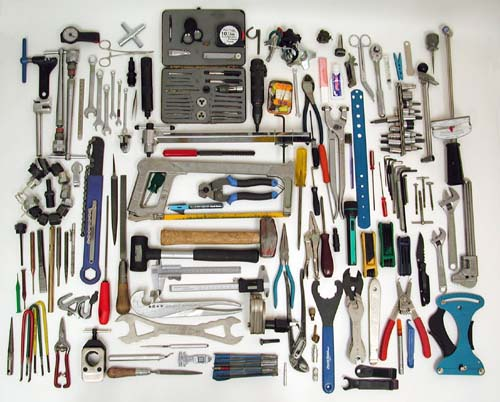

theme: Fira, 1

# Performance
## **#perfmatters**

^ (Front-end) That's us.
How does that effect the design

---

## Costs users **Time**
## Cost users **Money**
## Costs us **Money**

---

# Big Faces

 

^ Intro the other
Where work, What do

---

### **Agenda**

## 1. What is perf?
## 2. Why does it matter?
## 3. What's the effect?
## 4. What can we do?

---

# **1. What is perf?**

---

## **Performance**

# 1. Speed
# 2. Weight

^ Simplified version
E.g. Speed has perceived vs actual
Weight: how many MBs
Smaller better

---

# **2. Why does it matter?**

---

## UN Broadband Commission
## **500MB of data**
## < 5% of monthly income

^ affordability target

---

## South Africa
## **500MB of data**
## 1.5% of monthly income

^ **average** income
based on GNI per capita
**More than half** pop earn **less than half** of that

---

## 70% of South Africans
## less than R6,000 / month

^ mantaray.co.za, 2016

---

## South Africa (actually)
## **500MB of data**
## between 6% and 19% of monthly income

^ Which is more than 5

---

## People limit usage by buying small amounts

^ Because it's expensive

---

## **Convert airtime to data**
## That means out of bundle rates

^ More expensive
Not always not a choice:
looking for a job
applying for a job
LinkedIn

---

## Vodacom pre-paid
## **R9 for 15MB**
## R0.60 per MB

---

## httparchive.org
## **Average page size: 2.5MB**
## R1.5 per page

^ Doesn't seem so bad...

---

## Cashier R5,000 / month
## **10 pages a day**
## 9% of daily income

^ which is between 6 and 19

---

# :poop::poop::poop:

^ That is a very shit thing
Wish the poop wasn't smiling

---

# **3. What's the effect?**

---

# wpostats.com
## (mostly)

---

## Site
## **Stat**
## Effect

---

# **Yikes!**
# :scream:

---

## Bing

## **2s delay**
## 4.3% drop in revenue

---

## Google

## **0.5s slower load time**
## 25% fewer searches

---

## Financial Times

## **3s slower load time**
## 7.2% drop in articles read

^ further drops in engagement after a few weeks

---

## Amazon

## **0.1s slower load time**
## 1% decrease in revenue

^ Small percent, large number

---

## Etsy

## **160kb more images on mobile**
## 12% increase in bounce rate

---

# **Yay!**
# :smile:

---

## YouTube

## **90% smaller page size**
## large increase in traffic in areas with poor connectivity

^ Southeast Asia, South America, Africa, and Siberia.
Before, the page wouldn't load. Now it does!

---

## Instagram

## **30% smaller page size**
## increased impressions and interactions

---

## AliExpress

## **36% faster load time**
## 11% increase in orders

---

## **Perf Perps**
## 😱😱😱

^ Now you're appropriately horrified, let's look at some suspects

---

## Site
## **Stats**
## Why

^ Mostly local sites, with some guest stars
Like we looked at site, state, effect a moment ago
"Ish" stats, tested on 3G using Chrome's Throttling
Cost Benefit analysis

---

## **The stats**

## Requests
## MB

^ Because speed and weight
request: blocking, round trip. what's a good number of requests / size?
MB: average is 2.5MB. Not a **target**!

---

## dailymaverick.co.za
## **300 requests, 3.4MB**
## 1.5MB JS

^ JS! Tracking, ads, fancy widgets?
Also 1.3MB images

---

## mg.co.za
## **180 requests, 8MB**
## 6.8MB images

^ "high quality" JPGs, not large size?
120 images
lead into UX sites

---

## blog.invisionapp.com
## **150 requests, 9.1MB**
## 7.7MB Images

^ Wrong format

---

## medium.com
## **50 requests, 0.9MB**
## 0.5MB JS

^ text and images!

---

## cellc.co.za
## **130 requests, 1.8MB**
## 0.9MB images

^ images in carousel
Also 0.7MB JS

---

## capetown.gov.za
## **60 requests, 2.1MB**
## 1.7MB JS

^ 0.3MB is home hero
older, slower, phones
70% on less than R6,000 / month
tourist on roaming rates
health, education, water, electricity, Financial relief, jobs

---

# **4. What can we do?**

---

# Fewer fancy widgets

^ animations, transitions

---

# Fewer, smaller, images

^ autoplaying videos

---

## Measure front-end performance

^ FED because that's where it makes the most differnece
speedcurve.com, sitespeed.io

---

### **Tools**
## PageSpeed Insights
## WebPageTest

^ PSI: not because OMG Google :100:, but because good advice. use as checklist
WPT: lots of stats
"live" demo

---

## **Resources**

## naga.co.za/pup2017

^ short URL

---

## **Speaker spam**

## danielle.lisa.eriksen @gmail.com
## steve @naga.co.za

 

^ Thanks!
