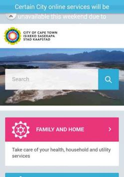

theme: Fira, 1

# **#perfmatters**

^ It's a thing.
Look it up on twitter.
Think about perf more in your day to day.

---

## Save users **time** and **money**
## Save us **time** and **money**

---

# Big Faces

 

^ Intro the other
Where work, What do

---

### **Agenda**

## 1. What?
## 2. So what?
## 3. Now what?

^ 1. What (is perf)?
2. So what? (Why should we care?)
4. Now what (can we do)?

---

# **1. What?**

^ The Front-end of what?

---

# (Front-end) Performance

^ What's Front-end?
(e.g. vs back-end)
Simplified version of perf because time

---

# 1. Speed

^ (Speed has perceived vs actual)
Save time for users

---

# 2. Weight

^ (Initial page load vs later)
How much stuff
Cheap for users
Less stuff means less work means less time and money for us

---

# **2. So what?**

^ **hit you in the feels**
Why should you care about your site's speed and weight?
A bit slow, a bit chunky, so what?
✋ who knows / uses Personas?

---

^ Bongani, proto-Persona

---

## **Bongani**
## Cashier at Pluck n Pay
## **R5,000 / month**

^ Persona: edge cases / worst case scenario!
But data's cheap, right?
She won't use the web! (FB!)

---

## "I want to look for a new job."

^ No computer, so it's gonna be on her phone.
What's that going to cost her?

---

## httparchive.org
## **Average page size: 2.5MB**

^ Doesn't seem so bad...
How much does that cost?

---

## Vodacom pre-paid
## **About R1.5 per page**

^ R9 for 15MB
R0.60 per MB
Usually worse than this
People limit usage by buying small amounts
Because it's expensive
Convert airtime to data: that means out of bundle rates

---

## Bongani looks for a job
## **10 pages a day: R15**
## Salary for the day: R240

^ 5k / m
=> 1.2k / week
=> 240 day
R15 out of R240 for the day
5% of her income

---

## Whisky
## Tango
## Foxtrot?

---

# :poop::poop::poop:

^ That is a very shit thing
Wish the poop wasn't smiling

---

# **2. So what?** (Part 2)

^ **time is money**
wpostats.com (mostly)
"Personas are made up? What about the real world?"
"Also, I sell organic artisinal diamonds, my customers are rich!"

---

## Site
## **Stat**
## Effect

---

# **Yikes!**
# :scream:

---

## Google

## **0.5s slower load time**
## 25% fewer searches

---

## Amazon

## **0.1s slower load time**
## 1% decrease in revenue

^ Small percent, large number

---

## Etsy

## **160kb more images on mobile**
## 12% increase in bounce rate

---

# **Yay!**
# :smile:

---

## YouTube

## **90% smaller page size**
## large increase in traffic in areas with poor connectivity

^ Southeast Asia, South America, Africa, and Siberia.
Before, the page wouldn't load. Now it does!

---

## Instagram

## **30% smaller page size**
## increased impressions and interactions

---

## AliExpress

## **36% faster load time**
## 11% increase in orders

---

# **2. So What?** (Part 3)

^ **not me!**
Perf Perps
Not blame game, more like:
look, it could happen to you

---

## Site
## **Stats**
## Why

^ Mostly local sites, with some guest stars
"Ish" stats, tested on 3G using WebPageTest
Cost Benefit analysis

---

## **The stats**

## Requests
## MB
## Time

^ Because speed and weight
request: blocking, round trip. what's a good number of requests / size?
Averages: about 100 requests (!), 2.5MB. Not a **target**!
Cost Benefit analysis

---

## dailymaverick.co.za
## **310 requests, 3.6MB, 40s**
## 1.7MB JS: ads and tracking

^ News is text and images.
No fancy widgets. Tracking, ads.
Also 1.4MB images
Cost Benefit analysis

---

## mg.co.za
## **290 requests, 9.9MB, 62s**
## 8.2MB images: lots, large, HD

^ "high quality" JPGs, not large size?
160 images

---

## medium.com
## **90 requests, 3.7MB, 30s**
## 0.5MB JS: for what? 2.9MB images: 67, really?

^ text and images!

---

## cellc.co.za
## **150 requests, 2MB, 33s**
## 1MB images: carousel

^ Remember Bongani?
Also 0.7MB JS

---

## capetown.gov.za
## **70 requests, 2.0MB, 20s**
## 1.7MB JS for animations

^ * Remember Bongani?
* Biggest JS: 0.3MB, 13,000 lines, things like animation
* health, education, water, electricity, Financial relief, jobs
* older, slower, phones
* Tourist on roaming rates (because FICA)
* 0.3MB is hero

---

# **4. Now what?**

^ **What can we do?**

---

## **Now what?**
# Use less stuff

^ Mental cost-benefit analysis

---

# **Images**
## Threat Level: :scream:

---

# **Carousels**
## Threat Level: :scream::scream:

---

# **Video**
## Threat Level: :scream::scream::scream:

---

# **Auto-playing Video**
## Threat Level: :skull: + :rage:

^ Not saying you're a monster.
But you should be ashamed of yourself.
😬

---

# **Animations**
## Threat Level: :scream: or :scream::scream:

---

# **Custom UI**
^ widget, sprockets, geegaws, doodads

## Threat Level: :scream: to :scream::scream::scream:

---

# **Tracking, Ads**

## Threat Level: :scream::scream::scream:

^ Especially the cumulative effect
Yes, #itscomplicated, but...

---

## **Now what?**
# Measure performance

^ FED because that's where it makes the most difference

---

## Your browser's Dev Tools: "Network" panel

^ Lots of stuff there!

---

## PageSpeed Insights
## WebPageTest

^ PSI: not because OMG Google :100:, but because good advice. use as checklist
WPT: lots of stats

---

## speedcurve.com

^ Monitoring service
Uses WPT

---

# **#perfmatters**

---

### **Zgenda**

## 1. What?
## 2. So what?
## 3. Now what?

^ 1. FED Perf is speed and weight
2. We can save time and money
3. Think about perf when desiging, measure perf

---

### **Thanks! :v:**

### danielle.lisa.eriksen @gmail.com
### steve @naga.co.za

 

### **naga.co.za/pup2017**

^ Email or on meetup
