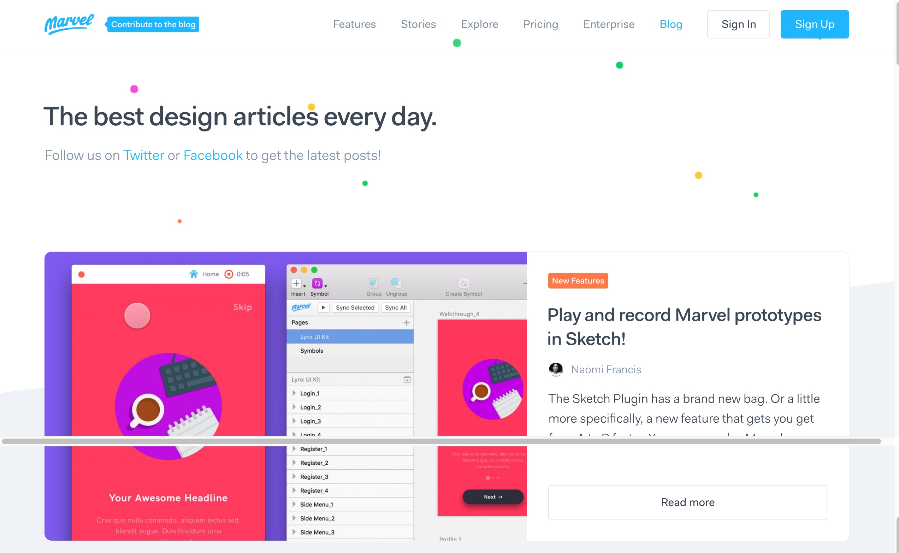
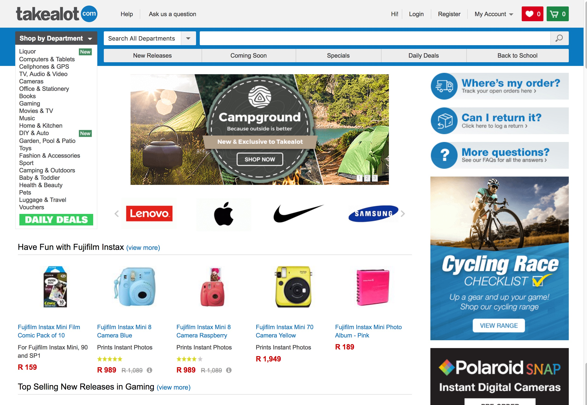
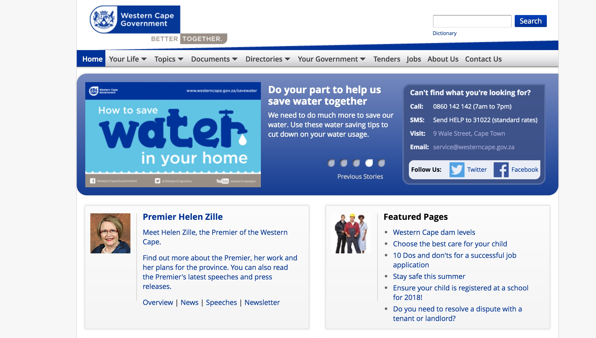

theme: Fira, 1

# Performance
## **#perfmatters**

^ (Front-end) That's us.
How does that effect the design

---

## Costs users **Time**
## Cost users **Money**
## Costs us **Money**

---

# Big Faces

 

^ Intro the other
Where work, What do

---

### **Agenda**

## 1. What is perf?
## 2. Why does it matter?
## 3. What's the effect?
## 4. What can we do?

---

# **1. What is perf?**

---

## **Performance**

# 1. Speed
# 2. Weight

^ Simplified version
E.g. Speed has perceived vs actual
Weight: how many MBs

---

# **2. Why does it matter?**

---

# **Big, wide, stats**

---

## UN Broadband Commission
## **500MB of data**
## < 5% of monthly income

^ affordability target

---

## South Africa
## **500MB of data**
## 1.5% of monthly income

^ **average** income
based on GNI per capita
**More than half** pop earn **less than half** of that

---

## South Africa (actually)
## **500MB of data**
## between 6% and 19% of monthly income

---

## 70% of South Africans
## less than R6,000 / month

^ mantaray.co.za, 2016

---

## People limit usage by buying small amounts
## **Convert airtime to data**
## That means out of bundle rates

^ More expensive

---

# :poop::poop::poop:

---

# **Little, narrow, stats**

---

## Vodacom pre-paid
## **R9 for 15MB**
## R0.60 per MB

---

## httparchive.org
## **Average page size: 2.5MB**
## R1.5 per page

^ Doesn't seem so bad...

---

## Cashier R5,000 / month
## **10 pages a day**
## 9% of daily income

^ which is between 6 and 19

---

# :poop::poop::poop:

^ That is a very shit thing
Wish the poop wasn't smiling

---

## **South Africa**
# Phones are older, slower

^ featurephones on the way out, yes
but cheap, low-power, smartphones
Lower CPU, RAM. Struggle with lots of JS from fancy widgets.

---

# **3. What's the effect?**

---

# wpostats.com
## (mostly)

---

## Site
## **Stat**
## Effect

---

# **Yikes!**
# :scream:

---

## Google DoubleClick stats

## **more than 3s to load**
## 53% of visits abandoned

^ "The need for mobile speed"

---

## Amazon

## **0.1s slower load time**
## 1% decrease in revenue

---

## Bing

## **1s delay**
## 2.8% drop in revenue

---

## Bing

## **2s delay**
## 4.3% drop in revenue

---

## Etsy

## **160kb more images on mobile**
## 12% increase in bounce rate

---

## Google

## **0.5s slower load time**
## 25% less searches

---

## Google

## **0.5s slower load time**
## 25% less searches

---

## Financial Times

## **1s slower load time**
## 4.9% drop in articles read

^ over a 7 day window

---

## Financial Times

## **3s slower load time**
## 7.2% drop in articles read

^ further drops in engagement after a few weeks

---

# **Yay!**
# :smile:

---

## Google DoubleClick stats

## **Faster sites (5s load time vs 19s)**
## 70% longer average session lengths

^ 35% lower bounce rates

---

## Netflix

## **Turned on gzip**
## 43% decrease in bandwidth bill

---

## Mozilla

## **2.2s faster load time**
## 15.4% increase in download conversions

---

## Yahoo

## **0.5s faster load time**
## 9% traffic increase

---

## Walmart

## **1s faster load time**
## 2% increase in conversions

---

## Walmart

## **0.1s faster load time**
## 1% increase in revenue

---

## YouTube

## **90% smaller page size**
## large increase in traffic in areas with poor connectivity

^ Southeast Asia, South America, Africa, and Siberia.

---

## GQ

## **80% faster load time**
## 80% increase in traffic

---

## Instagram

## **30% smaller page size**
## increased impressions and interactions

^ by 33% for the median and 50% for the 95th percentile for the main endpoint).

---

## AliExpress

## **36% faster load time**
## 10.5% increase in orders

---

# **3. What affects it?**

^ Now you're appropriately horrified, let's look at some suspects

---

## Site
## **Stat**
## Why

^ Like we looked at site, state, effect a moment ago
"Ish" stats, tested on 3G using Chrome's Throttling
Cost Benefit analysis

---

## medium.com
## **50 requests, 0.9MB**
## 0.5MB JS

^ text and images!

---

## nngroup.com
## **40 requests, 0.6MB**
## 0.3MB Images

^ Format
Loading some that are shown

---

## uxbooth.com
## **60 requests, 0.8MB**
## 0.3MB JS, 0.2MB CSS

---

## svpg.com
## **70 requests, 2.5MB**
## 0.7MB header image

^ 5500 x 1600 px
Also 0.5MB CSS

---

## blog.invisionapp.com
## **90 requests, 8.6MB**
## 7.6MB Images

^ Wrong format

---

## uie.com
## **30 requests, 0.4MB**
## 0.2MB background image

^ 1500 x 1400 image displayed at 250 x 200

---

## blog.marvelapp.com
## **50 requests, 5.8MB**
## 5.2MB images

^ huge images used as thumbs

---

## takealot.com
## **140 requests, 1.1MB**
## 0.3MB JS, 0.8MB images

^ PNGs, not JPGs

---

## loot.co.za
## **250 requests, 1.9MB**
## 1.7MB images, 0.2MB JS

^ 210 images

---

## computicket.com
## **210 requests, 1.8MB**
## 0.4MB JS, 1.2MB images

^ "online.computicket.com/web"
6-piece, big, carousel 0.3MB

---

## dailymaverick.co.za
## **230 requests, 2.3MB**
## 0.7MB JS, 0.3MB HTML, 1.2MB images

^ 178 images

---

## iol.co.za
## **120 requests, 2.2MB**
## 0.8MB JS, 1.4MB images

^ Big images, shown small

---

## news24.com
## **170 requests, 1.8MB**
## 0.3MB JS, 0.3MB CSS, 1.2MB images

^

---

## mg.co.za
## **280 requests, 7MB**
## 0.5MB JS, 6.2MB images

^ "high quality" JPGs, not large size?
120 images

---

## timeslive.co.za
## **600 requests, 4.6MB**
## 3.5MB images, 350 Ajax

^ 189 images
Ajax for stock ticker? And it keeps going...

---

## capetown.gov.za
## **150 requests, 2.1MB**
## 1.6MB JS, 0.5MB images

^ 0.3MB is home hero

---

## westerncape.gov.za
## **90 requests, 0.6MB**
## 0.15MB JS, 0.3MB

^ 00.15 small, but: WHY is it there at all?

---

## telkom.co.za
## **100 requests, 1.9MB**
## 0.4MB JS, 1.3MB images

^ 52 images

---

## vodacom.co.za
## **90 requests, 0.8MB**
## 0.3MB JS, 0.3MB images

^ 50 images

---

## mtn.co.za
## **137 requests, 2.4MB**
## 0.5MB JS, 1.7MB images

^ 0.6MB for one very bad image

---

## Cell C
## **170 requests, 2.7MB**
##  0.8MB JS, 1.6MB images

^ 1MB images in carousel

---

# **4. What can we do?**

---

## Measure front-end performance

^ FED because that's where it makes the most differnece
ask audience
millyun of ways

---

### Tools
## PageSpeed Insights
## WebPageTest

^ PSI: not because OMG Google :100:, but because good advice
use as checklist
WPT: lots of stats

---

## **Resources**

## naga.co.za/pup2017

^ short URL

---

## **Speaker spam**

## danielle.lisa.eriksen @gmail.com
## steve @naga.co.za

 
